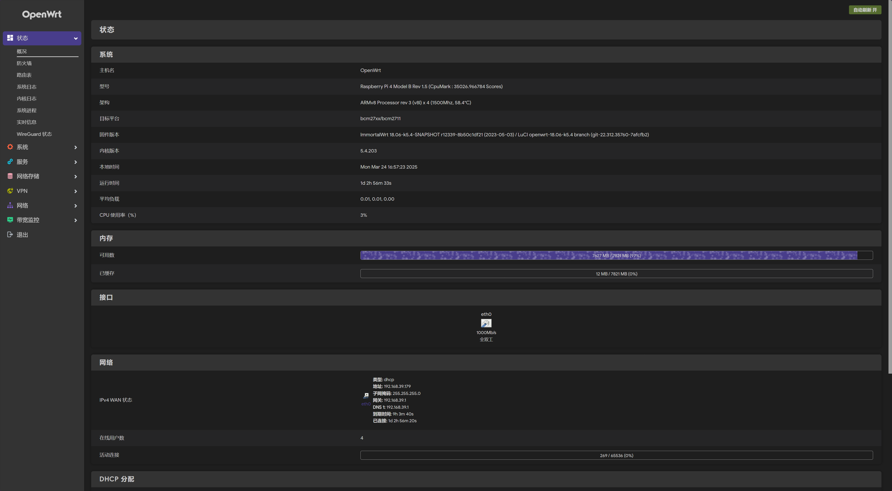

# 树莓派 4B 刷入 OpenWRT

为了安装 NixOS，同时方便管理很多设备的流程，简化上网环境，打算用闲置的树莓派 4B 刷如 OpenWRT，用作软路由。

## 固件准备

### 固件下载

方便起见，没有选择自己编译固件，
而使用了基于 18.06 的 [OpenWrt-Rpi](https://github.com/SuLingGG/OpenWrt-Rpi),
*目前已经归档*。
在 Release 中下载 [openwrt-bcm27xx-bcm2711](https://github.com/SuLingGG/OpenWrt-Rpi/releases/download/bcm27xx-bcm2711/immortalwrt-bcm27xx-bcm2711-rpi-4-ext4-factory.img.gz).

### 固件烧录

固件下载解压后，使用 [Raspberry Pi Imager](https://downloads.raspberrypi.org/imager/imager_latest.exe) 将镜像刷入 TF 卡。

准备好空闲的 TF 卡接入电脑，
打开 Raspberry Pi Imager，选择 Raspberry Pi 4 和解压好的镜像
`immortalwrt-bcm27xx-bcm2711-rpi-4-ext4-factory.img`，
选择 SD 卡，点击 NEXT。


## 启动配置

### 网络配置

由于对带宽要求不高，选择软路由做主路由的方案。
树莓派有线网口 `eth0` 连接可以上网的路由器，做 WAN 口；
无线网络热点做 LAN 口，连接网络设备。

镜像烧录完成后，将 SD 卡插入树莓派，以太网口连接路由器，插电启动。

启动后，固件默认配置了的无线网络 "OpenWRT"，接入后，访问 <http://192.168.1.1>，用户名 `root`，密码 `password`。



打开 `网络` - `接口` 配置，当前存在 LAN 和 VPN 两个接口。
当前的网络配置不涉及 VPN 接口，可以选择删除。

#### 编辑 LAN 接口

在上方 `物理设置` 部分，取消勾选 `桥接接口`，在下方只选择 `无线网络: ...`。

在下方 `高级设置` 部分，选中 `动态DHCP`，完成编辑后保存。

#### 新增 WAN 接口

`接口名称` 输入 `WAN`，`传输协议` 选择 `DHCP 客户端`，`包括以下接口` 选中 `以太网适配器: "eth0"`，提交。

编辑刚才新增的 WAN 接口，在防火墙设置中，分配防火墙区域选择 `wan:`，完成后点击 `保存&应用`。

## OpenClash 配置

### 客户端更新

固件内置的 OpenClash 客户端版本过低无法使用，需要更新。
前往 [OpenClash Release](https://github.com/vernesong/OpenClash/releases) 页面下载最新的 ipk 文件，上传到树莓派:

``` shell
scp luci-app-openclash*.ipk root@192.168.1.1:/tmp/openclash.ipk
```

随后 ssh 登录到树莓派，执行:

```shell
opkg update
opkg install bash iptables dnsmasq-full curl ca-bundle ipset ip-full iptables-mod-tproxy iptables-mod-extra ruby ruby-yaml kmod-tun kmod-inet-diag unzip luci-compat luci luci-base
opkg install /tmp/openclash.ipk
```

安装完成后重启树莓派，在 `服务` - `OpenClash`，可以看到更新的界面，在 `插件设置` - `版本更新` 页面，点击 `检查并更新` 下载最新内核。

之后，导入配置文件，启动 OPENCLASH，完成配置。

---
**Reference**:

[树莓派4B刷OpenWrt做路由器的经验+踩坑](https://zhuanlan.zhihu.com/p/451788328)

[树莓派4B安装OpenWrt](https://segmentfault.com/a/1190000039262209)
