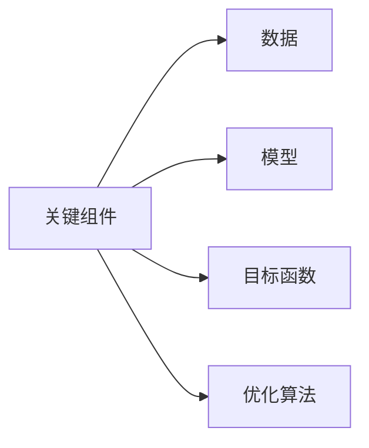
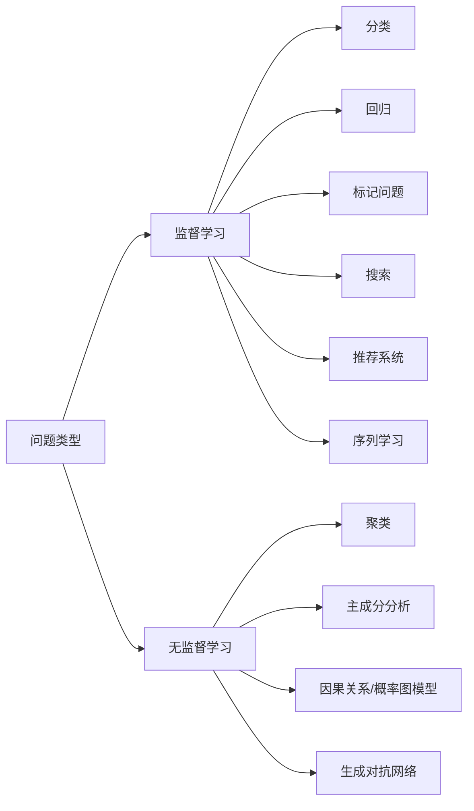
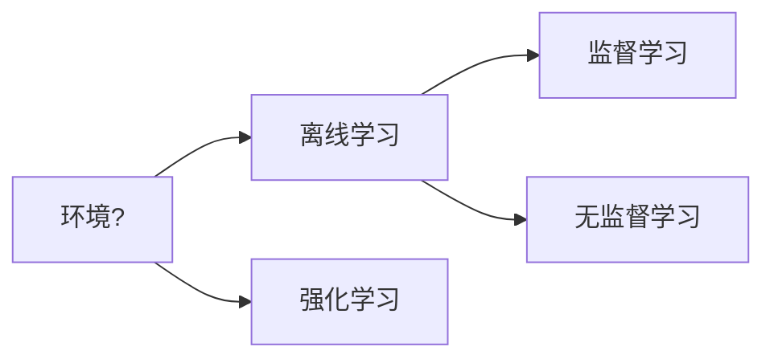

# 机器学习基础概念

AI 现在十分热门，为了不落后时代，决定从 *[DIVE INTO DEEP LEARNING](https://zh.d2l.ai/index.html)* 开始，入门一下深度学习。

今天学习了一些 ML 相关的概念。

## 机器学习中的关键组件

1. 可以用来学习的数据（data）；
2. 如何转换数据的模型（model）；
3. 一个目标函数（objective function），用来量化模型的有效性；
4. 调整模型参数以优化目标函数的算法（algorithm）。

## 监督学习/无监督学习

监督学习（supervised learning）擅长在“给定输入特征”的情况下预测标签。
每个“特征-标签”对都称为一个样本（example）。
我们的目标是生成一个模型，能够将任何输入特征映射到标签（即预测）。

数据中不含有“目标”的机器学习问题通常被为无监督学习（unsupervised learning）.

## 强化学习

监督学习和无监督学习都是与环境分离的：预先获取大量数据，训练模型，当模型启动后，不在与环境进行交互。
强化学习则考虑了环境的影响：智能体获取环境状态，做出一些动作，并且可能改变环境。

在强化学习问题中，智能体（agent）在一系列的时间步骤上与环境交互。
在每个特定时间点，智能体从环境接收一些观察（observation），
并且必须选择一个动作（action），
然后通过某种机制（有时称为执行器）将其传输回环境，
最后智能体从环境中获得奖励（reward）。
此后新一轮循环开始，智能体接收后续观察，并选择后续操作，依此类推。
强化学习的目标是产生一个好的策略（policy）。
强化学习智能体选择的“动作”受策略控制，即一个从环境观察映射到行动的功能。

## 思考

> 如果把人工智能的发展看作一场新的工业革命，那么算法和数据之间的关系是什么？它类似于蒸汽机和煤吗？根本区别是什么？

**动力与燃料的角色**:

- 在工业革命中，蒸汽机是核心技术（动力装置），而煤是驱动蒸汽机的燃料。没有煤，蒸汽机无法运转；没有蒸汽机，煤的能量也无法转化为实际的工业生产力。
- 在AI中，算法（尤其是机器学习算法）类似于蒸汽机，是处理和转化数据的“引擎”；数据则类似于煤，是算法运行的“燃料”。算法依赖数据来训练、优化和产生结果，而数据没有算法的加工也只是无意义的原始素材。

**相互依赖性**：

- 蒸汽机的效率和输出功率取决于煤的质量和数量，优质煤能让蒸汽机更高效地工作。
- 同样，算法的性能高度依赖数据的质量（准确性、丰富性）和数量（大规模数据集能提升模型的泛化能力）。高质量的数据能让算法更精准，而先进的算法也能从有限或嘈杂的数据中挖掘出更多价值。

**推动革命的协同作用**：

- 蒸汽机和煤的结合催生了工厂、铁路和大规模生产，改变了社会经济结构。
- 算法和数据的结合推动了AI在各领域的应用（如医疗、金融、自动驾驶），重塑了现代社会的运作方式，堪称“智能革命”的基础。
