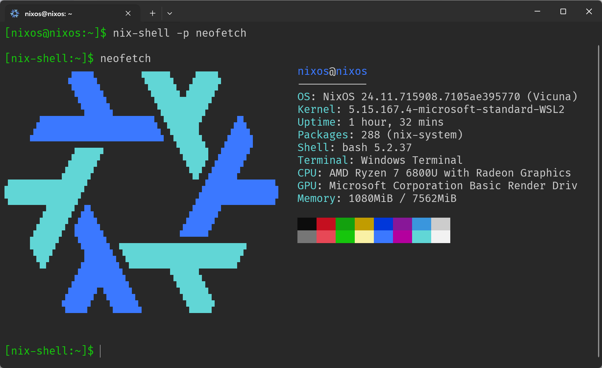

# 在 WSL 中安装 NixOS



NixOS 便于迁移，可以通过配置文件在任何地方复制同样的环境。
WSL 安装 NixOS，是学习 nix 的一个很好的方式。

## 安装

以下命令在 Powershell 中执行：

1. 启用 WSL

    ``` shell
    wsl --install --no-distribution
    ```

2. 在 [这里](https://github.com/nix-community/NixOS-WSL/releases/latest) 下载 `nixos.wsl` 最新的 Release。
3. 检查 wsl 版本，*需要 > 2.4.4*

    ``` shell
    wsl --version
    ```

4. 从文件安装 NixOS WSL:

    ``` shell
    wsl --install --from-file nixos.wsl
    ```

5. （可选）NixOS 设为默认

    ``` shell
    wsl -s NixOS
    ```

> [!TIP]
> 低于 2.4.4 的 WSL 安装方式可以在 [这里](https://nix-community.github.io/NixOS-WSL/) 找到

## 运行和配置

完成安装后，可以进行一些初始化配置，让 NixOS WSL 的使用更加丝滑。

1. 进入 NixOS WSL

    ``` shell
    wsl -d NixOS
    ```

2. 更新 channel

    ``` shell
    sudo nix-channel --update
    sudo nixos-rebuild
    ```

### 配置 VSCode Remote

NixOS WSL 中无法直接使用 VSCode Remote，需要 `/lib64/ld-linux-x86-64.so`。
直接打开 `code .` 会报错：

``` shell
[nixos@nixos:~] code .
Could not start dynamically linked executable: /home/nixos/.vscode-server/bin/ddc367ed5c8936efe395cffeec279b04ffd7db78/node
NixOS cannot run dynamically linked executables intended for generic
linux environments out of the box. For more information, see:
https://nix.dev/permalink/stub-ld
```

解决这个问题有两个选择，这里使用第一种。另一种方式可以在 [这里](https://nix-community.github.io/NixOS-WSL/how-to/vscode.html#option-2-patch-the-server) 找到

#### 1. 安装 wget

NixOS 的系统配置存放在 `/etc/nixos/configuration.nix` 文件中，通过这个文件及其引用的各个配置文件，可以恢复出一个相同的 NixOS。

nix 语法支持 `include` 引入其他 `.nix` 配置，通过 include 组织配置文件可以使配置模块化，操作更加灵活。

首先在 `/etc/nixos/` 目录下创建 `pkgs.nix` 文件：

``` nix
{ config, lib, pkgs, ... }:

{
  environment.systemPackages = [
    pkgs.wget
  ];
}
```

> [!TIP]
> NixOS 默认没有安装 vim / vi 编辑器，使用 nano 编辑文本。
>
> 如果习惯使用 vim，可以在 pkgs.nix 文件中加入 `pkgs.vim`
>
> ``` nix
> { config, lib, pkgs, ... }:
> 
> {
>   environment.systemPackages = [
>     pkgs.vim
>     pkgs.wget
>   ];
> }
> ```

完成后，在 `configurations.nix` 中引用。

``` nix
...
  imports = [
    ./pkgs.nix # 添加 pkgs.nix 的引用
    # include NixOS-WSL modules
    <nixos-wsl/modules>
  ];
...
```

#### 2. 配置 nix-ld

[nix-ld](https://github.com/Mic92/nix-ld) 提供了 VSCode Remote 需要的 `/lib64/ld-linux-x86-64.so.2`，允许外部二进制在 NixOS 上运行。

同样使用文件组织 nix-ld 的配置，`nix-ld.nix` 文件如下：

``` nix
{ config, lib, pkgs, ... }:

{
  programs.nix-ld = {
    enable = true;
    package = pkgs.nix-ld-rs; # only for NixOS 24.05
  };
}
```

在 `configuration.nix` 中引用：

``` nix
...
  imports = [
    ./pkgs.nix
    ./nix-ld.nix
    # include NixOS-WSL modules
    <nixos-wsl/modules>
  ];
...
```

#### 3. 重新构建系统

NixOS 通过配置文件记录系统配置，配置修改后，需要通过 `rebuild` 使配置生效。

```shell
sudo nixos-rebuild
```

Reference: [NixOS|WSL](https://nix-community.github.io/NixOS-WSL/)
