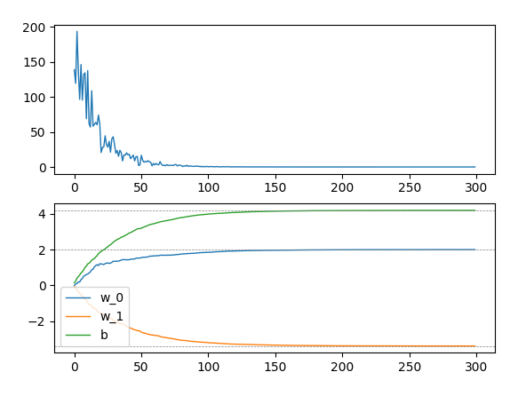

# 使用 PyTorch 从零开始实现线性回归

线性回归是神经网络学习的起点。
通过线性回归，可以了解到神经网络的基本概念和搭建神经网络的步骤。

## 生成数据集

通过这个函数生成线性回归的数据集。
满足：
$$
\mathbf{y} = \mathbf{X}\mathbf{w} + b + \epsilon
$$

其中，$\mathbf{w}=[2, -3.4]^\top$, $b=4.2$, $\epsilon$ 满足正态分布 $\mathcal{N}(0, 0.01).$

``` python
def synthetic_data(w, b, n, mu=0, theta=0.01):
    X = torch.normal(0, 1, (n, len(w)))
    y = torch.matmul(X, w) + b
    y += torch.normal(mu, theta, y.shape)
    return X, y.reshape((-1, 1))
```

```python
true_w = torch.tensor([2, -3.4])
true_b = 4.2
features, labels = synthetic_data(true_w, true_b, 1000)
```

## 定义模型

采用线性模型 $\mathbf{y} = \mathbf{X}\mathbf{w} + b$,
从神经网络的角度来看，线性模型是是一个只有一层的模型。
其中，输入数是 $\mathbf{x_i}$ 向量的维数（这里是 $2$），
输出数是 $y$ 的维数，这里是 $1$.
层数只有输出层一层。此外，所有的输入都和所有的输出相连接，因此，输出层是全连接层。

```python
def linreg(X, w, b):
    return torch.matmul(X, w) + b
```

## 定义损失函数

回归问题中最常用的损失函数是平方误差函数。
当样本 $i$ 的预测值为 $\hat{y}^{(i)}$，
其相应的真实标签为 ${y}^{(i)}$ 时，
平方误差可以定义为以下公式：

$$
l^{(i)}(\mathbf{w}, b) = \frac{1}{2}(\hat{y}^{(i)} - y^{(i)}) ^ 2
$$

```python
def squared_loss(y_hat, y):
    return 0.5 * (y_hat - y.reshape(y_hat.shape)) ** 2
```

## 定义优化算法

使用小批量随机梯度下降算法（minibatch stochastic gradient descent），
通过不断地在损失函数递减的方向上更新参数来降低误差。

这个过程可以用以下公式表示：

$$
(\mathbf{w},b) \leftarrow (\mathbf{w},b) - \frac{\eta}{|\mathcal{B}|}\sum_{i\in \mathcal{B}} \partial_{(\mathbf{w},b)}l^{(i)}(\mathbf{w},b)
$$

其中，$\eta$ 表示学习率。$\mathcal{B}$ 表示一个小批量抽样，由固定数量的训练样本组成。

以下代码实现了根据学习率更新模型参数的过程。

```python
def sgd(params, lr, batch_size):
    with torch.no_grad():
        for param in params:
            param -= lr * param.grad / batch_size
            param.grad.zero_()
```

`with torch.no_grad():` 块用于禁用自动梯度计算，构建新的计算图。
更新参数的过程是一个纯粹的数学运算，不涉及反向传播和计算图构建，
因此，这里使用 `no_grade()`，不追踪 `param` 张量的操作。

## 训练模型

模型训练遵循以下步骤：

1. 设定超参数，初始化模型参数。

    ``` python
    lr = 0.03       # 学习率
    num_epochs = 3  # epoch 数
    batch_size = 10 # 批量大小

    # 随机初始化 w
    w = torch.normal(0, 0.01, size=(2,1), requires_grad=True)
    # 初始化 b 为 0 
    b = torch.zeros(1, requires_grad=True)
    ```

2. 循环优化:
   1. 计算损失函数
   2. 反向传播，计算梯度
   3. 更新参数

    ```python
    for epoch in range(num_epochs):
        for X, y in data_iter(batch_size, features, labels):
            l = squared_loss(linreg(X, w, b), y)
            l.sum().backward()
            sgd([w, b], lr, batch_size)
    ```

其中，`epoch` 和 `batch` 是两个不同的概念。

`epoch` 遍历整个数据集，
`num_epochs = 3`，表示训练过程会遍历三次数据集。
`data_iter` 将数据集分为多个批次，每次返回其中一部分数据（`batch`）。
当所有小批次都处理完一遍，也就是整个训练数据集被模型 “看到” 并用于训练了一次，这就完成了一个 epoch。

> [!NOTE]
> 为什么需要多个 epoch？
>
> - 单次遍历不够：一次 epoch 可能不足以让模型学到数据的全部模式，多次遍历可以让模型逐步逼近损失函数的最优解。
> - 优化过程：通过多个 epoch，模型的参数（如权重和偏置）会根据梯度下降逐渐调整，误差会逐渐减小。



---

**Reference**: [3.2. 线性回归的从零开始实现 — 动手学深度学习 2.0.0 documentation](https://zh.d2l.ai/chapter_linear-networks/linear-regression-scratch.html)
